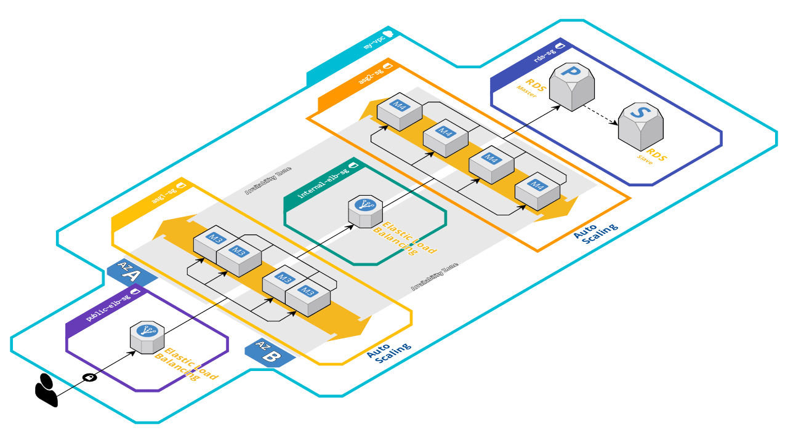

# Infrastructure code for "Web App Reference Architecture (complete)"


### [View all Roadmaps](https://github.com/nholuongut/all-roadmaps) &nbsp;&middot;&nbsp; [Best Practices](https://github.com/nholuongut/all-roadmaps/blob/main/public/best-practices/) &nbsp;&middot;&nbsp; [Questions](https://www.linkedin.com/in/nholuong/)
<br/>

This repository contains Terraform configuration files which were automatically generated from blueprint created using [Cloudcraft](https://www.cloudcraft.co).

### Original infrastructure



---

[Terragrunt](https://github.com/nholuongut/nholuong-terragrunt) is used to work with Terraform configurations which allows to orchestrate dependent layers, update arguments dynamically and keep configurations [DRY](https://en.wikipedia.org/wiki/Don%27t_repeat_yourself).

## Table of Contents

1. [Quick start](#quick-start)
1. [Configure access to AWS account](#configure-access-to-aws-account)
1. [Create and manage your infrastructure](#create-and-manage-your-infrastructure)
1. [References](#references)
1. [About d2c.modules.tf](#about-d2cmodulestf)


## Quick start

1. [Install Terraform 0.15 or newer](https://learn.hashicorp.com/tutorials/terraform/install-cli)
1. [Install Terragrunt 0.29 or newer](https://github.com/nholuongut/nholuong-terragrunt)
1. Optionally, [install pre-commit hooks](https://pre-commit.com/#install) to keep Terraform formatting and documentation up-to-date.

If you are using macOS you can install all dependencies using [Homebrew](https://brew.sh/):

    $ brew install terraform terragrunt pre-commit

## Configure access to AWS account

The recommended way to configure access credentials to AWS account is using environment variables:

```
$ export AWS_DEFAULT_REGION=eu-west-1
$ export AWS_ACCESS_KEY_ID=...
$ export AWS_SECRET_ACCESS_KEY=...
```

Alternatively, you can edit `terragrunt.hcl` and use another authentication mechanism as described in [AWS provider documentation](https://registry.terraform.io/providers/hashicorp/aws/latest/docs#authentication).

## Create and manage your infrastructure

Infrastructure consists of multiple layers (rds_2, rds_1, autoscaling_2, ...) where each layer is described using one [Terraform module](https://www.terraform.io/docs/configuration/modules.html) with `inputs` arguments specified in `terragrunt.hcl` in respective layer's directory.

Navigate through layers to review and customize values inside `inputs` block.

There are two ways to manage infrastructure (slower&complete, or faster&granular):
- **Region as a whole (slower&complete).** Run this command to create infrastructure in all layers in a single region:

```
$ cd eu-west-1
$ terragrunt run-all apply
```

- **As a single layer (faster&granular).** Run this command to create infrastructure in a single layer (eg, `rds_2`):

```
$ cd eu-west-1/rds_2
$ terragrunt apply
```

After the confirmation your infrastructure should be created.


## References

* [Terraform documentation](https://www.terraform.io/docs/) and [Terragrunt documentation](https://github.com/nholuongut/nholuong-terragrunt/docs/) for all available commands and features
* [Terraform AWS modules](https://github.com/nholuongut/terraform-aws-modules)
* [Terraform modules registry](https://registry.terraform.io/)
* [Terraform best practices](https://www.terraform-best-practices.com/)


## About d2c.modules.tf

[modules.tf](https://github.com/anholuongut/modules.tf-lambda) is an open-source project created by [Anton Babenko](https://github.com/antonbabenko):
1. Questions, bugs and feature-requests - [open an issue](https://github.com/anholuongut/modules.tf-lambda).
1. [Become a sponsor to @antonbabenko](https://github.com/sponsors/antonbabenko/).
1. You are always welcome to share, star, like, tweet, follow!

[](https://github.com/anholuongut/modules.tf-lambda)

All content, including [Terraform AWS modules](https://github.com/nholuongut/terraform-aws-modules) used in these configurations, is released under the MIT or Apache License.

# 🚀 I'm are always open to your feedback.  Please contact as bellow information:
### [Contact ]
* [Name: nho Luong]
* [Skype](luongutnho_skype)
* [Github](https://github.com/nholuongut/)
* [Linkedin](https://www.linkedin.com/in/nholuong/)
* [Email Address](luongutnho@hotmail.com)


[](https://ko-fi.com/nholuong)

# License
* Nho Luong (c). All Rights Reserved.🌟